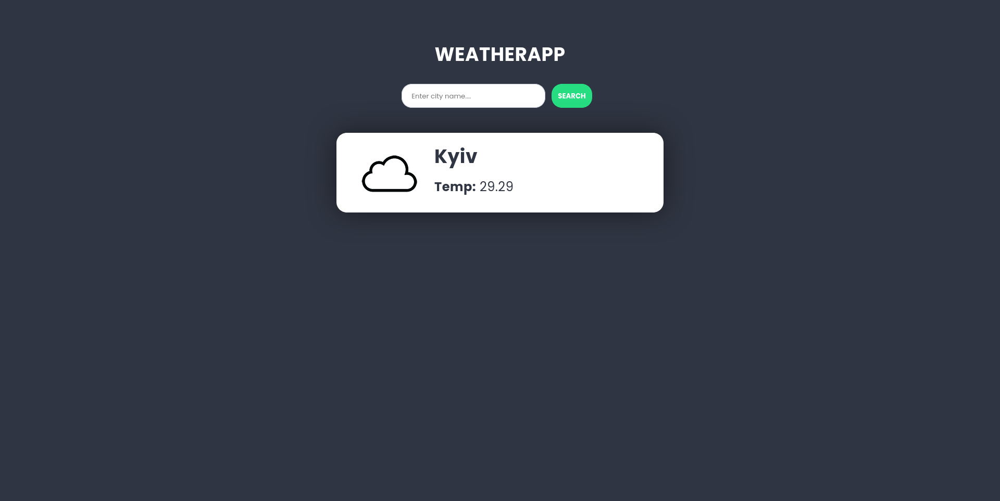

#  WeatherApp

A clean and minimal weather application built with **React**. Enter any city name to instantly get current weather details, including temperature and weather condition.



---

##  Features

-  Search weather by city name
-  Real-time temperature display
-  Weather icon indicating condition
-  Simple and responsive UI

---

##  Tech Stack

- **React**
- **CSS / SCSS**
- **Fetch API** (for weather data)
- [OpenWeatherMap API](https://openweathermap.org/api)

---

##  Getting Started

### Clone & Install

```bash
git clone https://github.com/cayceworld/weather-base.git
cd weather-base
yarn install

